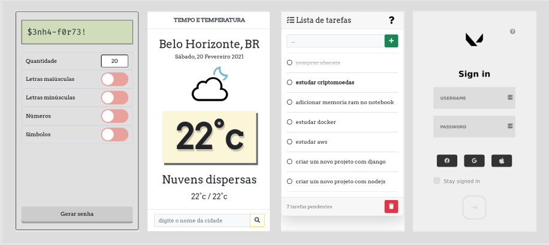

# Front-end sites

> Some projects using HTML, CSS and Javascript

<!-- [Click here and check it out](https://almeida-matheus.github.io/front-end) -->
<h1>

<!-- <h3 align="center">
    <a href="https://almeida-matheus.github.io/front-end">See the project</a>
<h3 > -->

<h3 align="center">
      
</h3>